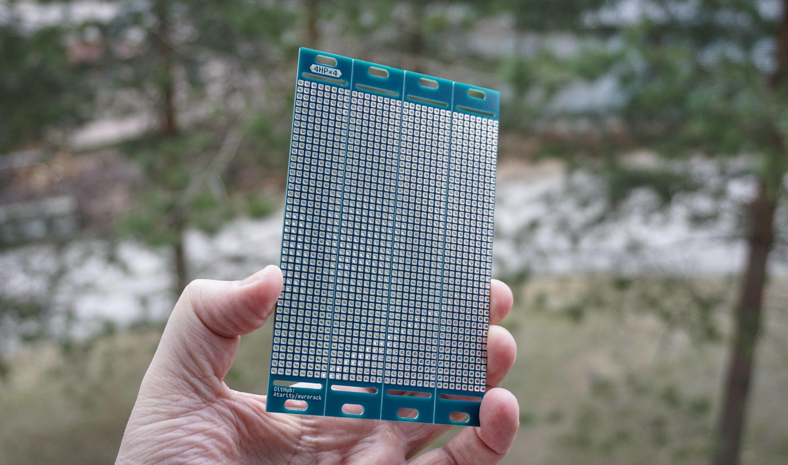
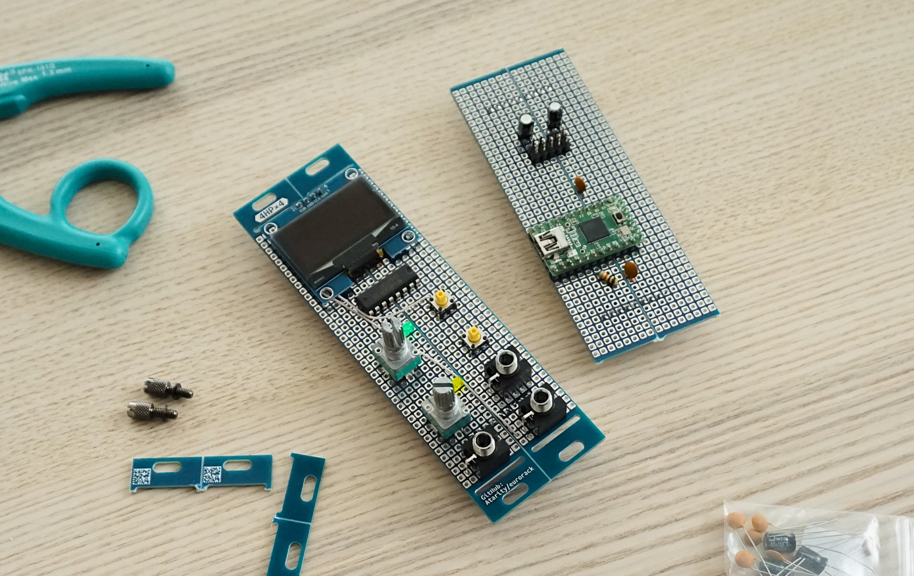

# 4x4
4x4 — eurorack compatible 16HP breadboard with adjustable width. There is number of features for versatile prototyping:
- 16HP panel can be cracked manually to 4HP sections thru v-cuts
- Mounting holes areas can be cut to use breadboard as a 2nd layer pcb under panel layer
- 2.54 spacing for all soldering points across whole panel
- Increased holes diameter, increased pads area

[Blog post with project details](https://snnkv.com/projects/4x4/)

## Dimensions
- Height: 3U, 128.5mm, 41 solder points
- Width: 16HP, 81mm, 32 solder points

>IMPORTANT: gerbers were generated according to [JLCPCB v-cut panelization standards](https://jlcpcb.com/blog/technical-guidance-v-cut-panelization-standards). Check your manufacturer v-cut specs and adapt source layout if required.

4x4 inspired by [npi3pack/eurorack-stripboard](https://github.com/npi3pak/eurorack-stripboard) project 👍.