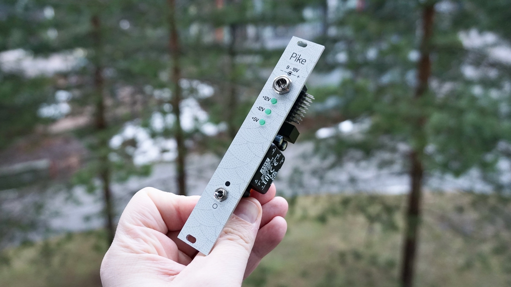
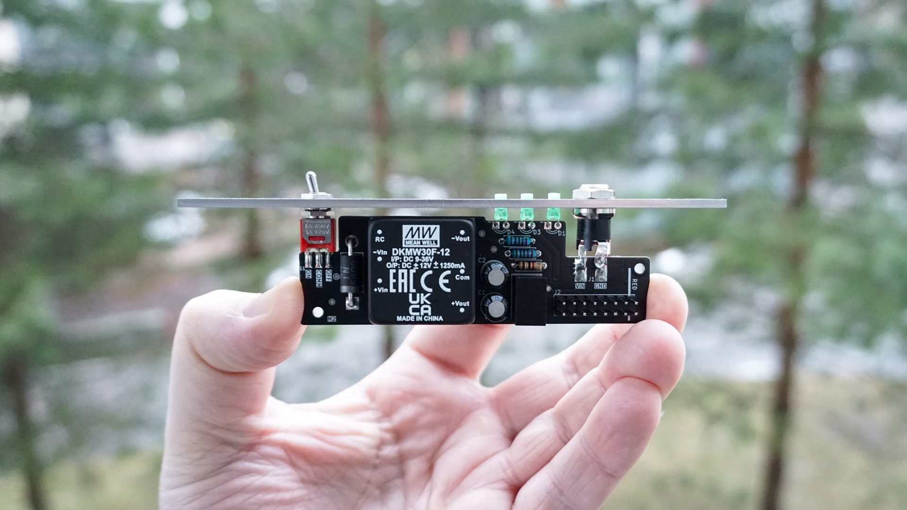

# Pike
Pike — 4HP power for compact racks. It based on turn-key MeanWell PSU with minimum possible additional components. Pike is just a relayout of [Excalibus power bus by Befaco](https://www.befaco.org/excalibus/) made to use with flying bus.

- [Mouser cart](https://www.mouser.fi/ProjectManager/ProjectDetail.aspx?AccessID=896566e5e1)
- [Blog post with project details](https://snnkv.com/projects/pike/)

## Specs
- IN
    - DC 9-18V
    - You can use 15V@3A (45W) external AC-DC power supply from laptop
    - Central pin positive (socket pin 2.1mm)
- OUT
    - +12V up to 1.25A
    - -12V up to 1.25A
    - +5V up to 0.4A

## Dimensions
- Height: 3U
- Width: 4HP
- Depth: 28mm

It is possible to install module inside of a rack thru M2-M2.5 screws and not to use front panel at all.

